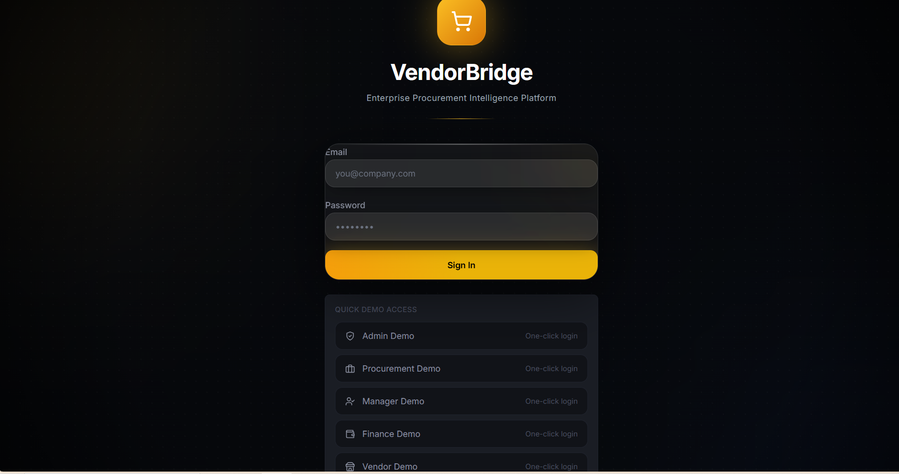
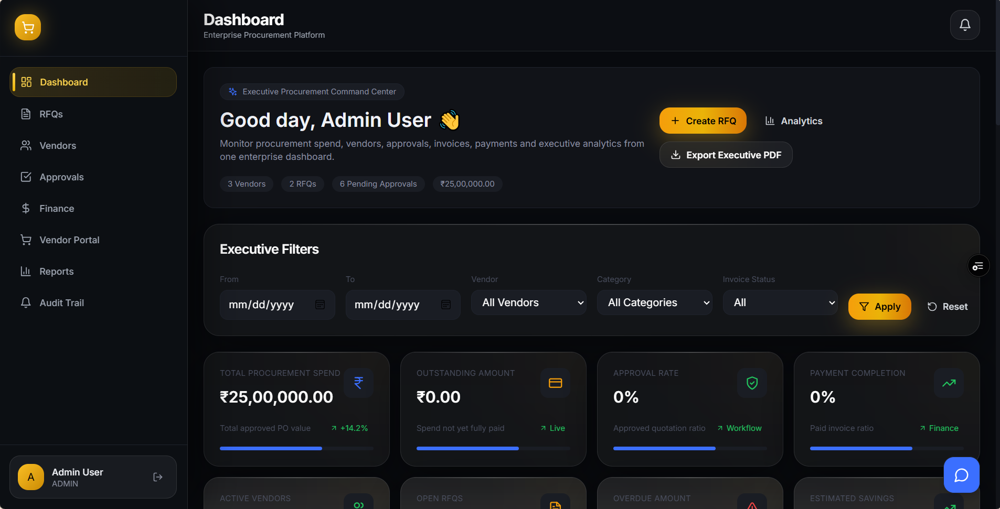
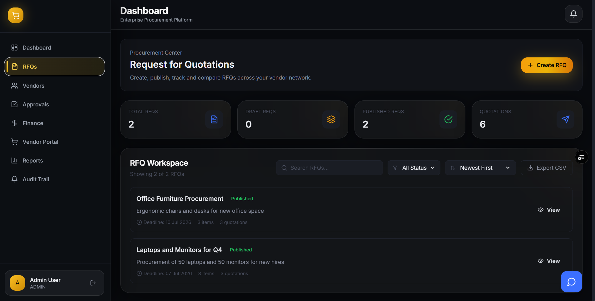
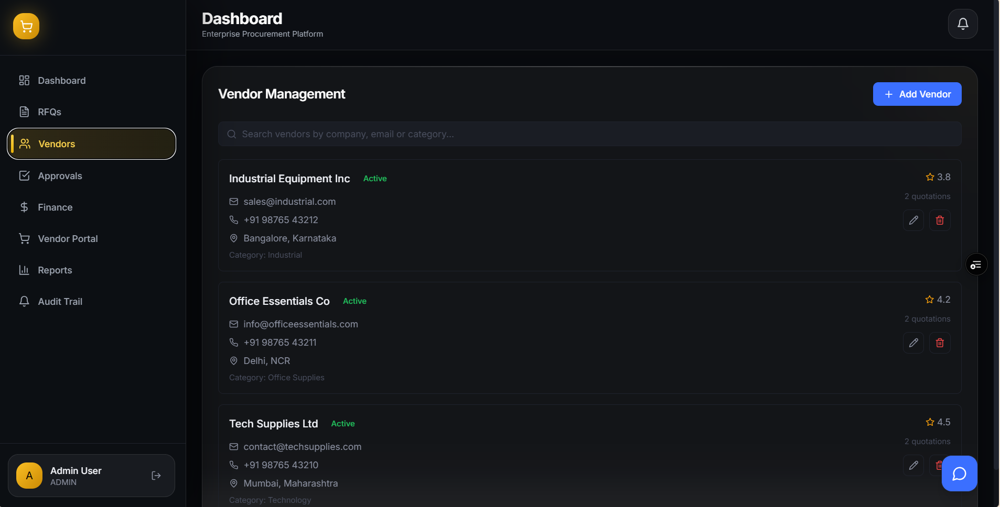
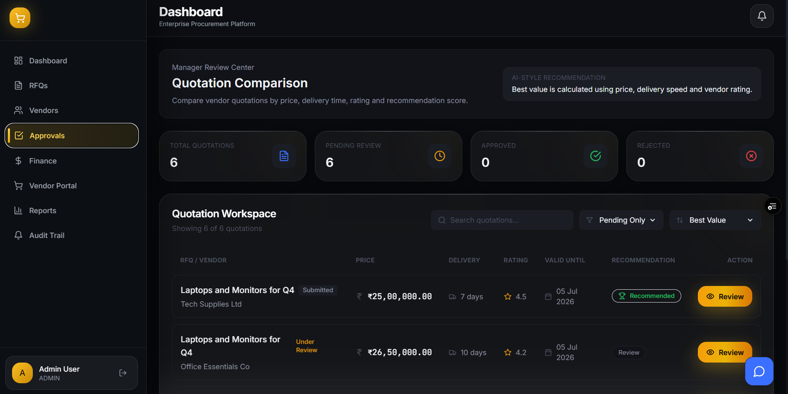
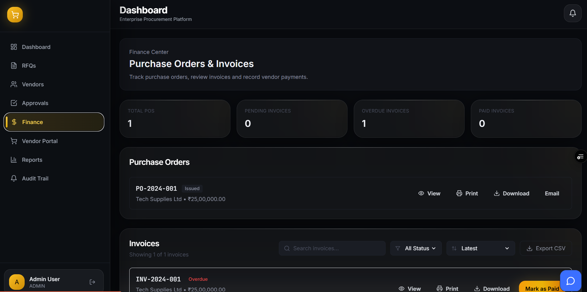
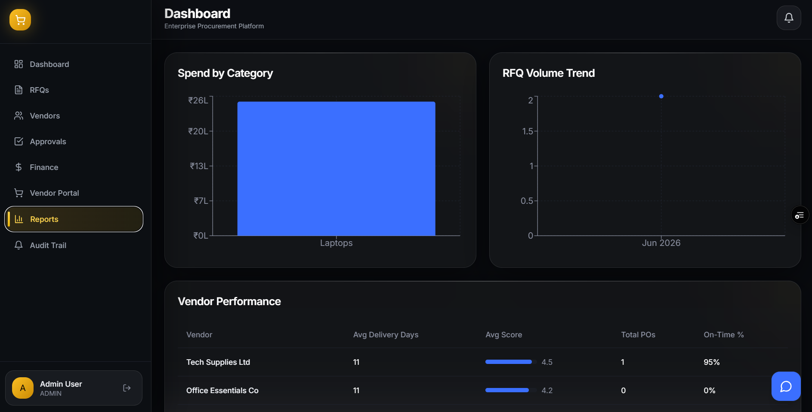
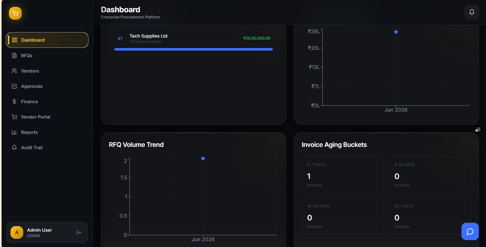

<div align="center">

# VendorBridge

### Enterprise Procurement Intelligence Platform

**From RFQ to payment — one connected procurement command center.**

[Live Application](https://real-vendor-bridge-tau.vercel.app/login) · [API Status](https://real-vendorbridge.onrender.com/) · [API Documentation](https://real-vendorbridge.onrender.com/api/docs)

</div>

---

## Overview

VendorBridge is a full-stack B2B procurement and vendor management platform designed to digitize the complete procurement lifecycle.

It connects internal procurement teams, managers, finance teams, administrators, and external vendors through one role-based system.

The platform manages the complete workflow:

**RFQ → Quotation → Comparison → Approval → Purchase Order → Invoice → Payment → Analytics**

VendorBridge was built as a production-style SaaS application rather than a static dashboard. It includes real backend APIs, persistent PostgreSQL data, authentication, role-based authorization, workflow validation, notifications, analytics, reporting, AI-assisted insights, and cloud deployment.

---

## Live Product

| Service | Link |
| --- | --- |
| Frontend | [Open VendorBridge](https://real-vendor-bridge-tau.vercel.app/login) |
| Backend API | [API Health Status](https://real-vendorbridge.onrender.com/) |
| Swagger Docs | [Interactive API Documentation](https://real-vendorbridge.onrender.com/api/docs) |

> The backend is hosted on Render and may require a short cold-start period after inactivity.

---

## Product Preview

### Authentication



### Executive Dashboard



### Procurement Workflow



### Vendor Management



### Approval Workflow



### Finance Operations



### Reports



### Executive Analytics



---

## The Problem

Procurement workflows are often fragmented across:

- spreadsheets
- email threads
- vendor calls
- manually compared quotations
- disconnected approval processes
- invoice records
- payment tracking systems
- static management reports

This creates poor visibility, slower approvals, inconsistent vendor evaluation, and limited auditability.

---

## The Solution

VendorBridge creates a single procurement operating system where every stage of the purchasing lifecycle is connected.

Procurement teams create RFQs, vendors submit quotations, managers review approvals, purchase orders are generated, finance teams process invoices and payments, and executives monitor the complete operation through analytics and reports.

Every role sees the tools and information relevant to its responsibilities.

---

## End-to-End Workflow

```text
Procurement Team
       |
       v
Create & Publish RFQ
       |
       v
Vendors Submit Quotations
       |
       v
Compare Price + Delivery + Vendor Rating
       |
       v
Manager Approval / Rejection
       |
       v
Purchase Order
       |
       v
Vendor Invoice
       |
       v
Finance & Payment Tracking
       |
       v
Reports + Executive Analytics

Role-Based Experience
Admin
executive dashboard
system-wide KPIs
vendor visibility
procurement monitoring
reports and analytics
audit trail access
Procurement Officer
create and manage RFQs
manage vendors
review quotations
compare vendor offers
track procurement activity
Manager
review pending quotation approvals
approve or reject decisions
add review comments
monitor approval activity
Finance
monitor purchase orders
manage invoices
record payments
track outstanding and overdue amounts
access financial reports
Vendor
view available RFQs
submit quotations
track quotation status
monitor purchase orders
manage invoice workflow
Core Features
Procurement Lifecycle
multi-item RFQ creation
RFQ publishing and deadline management
vendor quotation submission
quotation comparison
approval and rejection workflow
purchase order generation
invoice management
payment tracking
Enterprise Access Control
JWT authentication
protected routes
role-based authorization
five separate business roles
role-specific navigation and dashboards
Executive Intelligence
procurement KPI cards
spend analytics
outstanding and overdue tracking
RFQ activity trends
vendor performance metrics
category spend analysis
approval rate monitoring
payment completion metrics
Reporting
executive analytics
AI-assisted procurement insights
vendor performance reporting
spend reports
downloadable executive PDF reports
Operational Features
notification center
activity timeline
audit trail
workflow validation
server-side input validation
API documentation with Swagger
Quotation Intelligence

VendorBridge evaluates quotations using three business factors:

50% Price
30% Delivery Speed
20% Vendor Rating

const score = (
  (1 - normalizedPrice) * 0.5 +
  (1 - normalizedDelivery) * 0.3 +
  (vendorRating / 5) * 0.2
) * 100;

System Architecture

                    USER
                      |
                      v
              React + TypeScript
                 Vite Frontend
                      |
                      v
                 REST API
                      |
                      v
              Node.js + Express
                      |
          +-----------+-----------+
          |           |           |
          v           v           v
     JWT / RBAC    Prisma ORM   Swagger
                      |
                      v
                 PostgreSQL

Production Deployment

User Browser
     |
     v
Vercel Frontend
     |
     v
Render Backend API
     |
     v
Cloud PostgreSQL Database

Technology Stack
Frontend
React 18
TypeScript
Vite
React Router
Tailwind CSS
Framer Motion
Recharts
Zustand
Axios
React Hook Form
Zod
date-fns
Backend
Node.js
Express.js
TypeScript
Prisma ORM
PostgreSQL
JWT
bcrypt
Zod
Multer
Swagger / OpenAPI
Deployment
Vercel — frontend
Render — backend
Cloud PostgreSQL — database
GitHub — source control
Demo Access

The public deployment includes dedicated sample accounts for testing the role-based experience.

Role	Email	Password
Admin	admin@vendorbridge.com	demo123
Procurement	procurement@vendorbridge.com	demo123
Manager	manager@vendorbridge.com	demo123
Finance	finance@vendorbridge.com	demo123
Vendor	vendor1@techsupplies.com	demo123

These are demo-only accounts containing sample data.

API Documentation

Interactive Swagger documentation is available at:

https://real-vendorbridge.onrender.com/api/docs

Major API groups include:

/api/auth
/api/vendors
/api/rfqs
/api/quotations
/api/purchase-orders
/api/invoices
/api/reports
/api/notifications
/api/activities
/api/analytics
/api/ai
/api/executive-report
Business Validation Rules

VendorBridge enforces workflow rules including:

RFQ deadlines must be at least three days in the future
quotations cannot be submitted after an RFQ deadline
quotation prices must be greater than zero
invoice amounts are validated against purchase order totals
payment references are required for bank transfers
vendor email addresses must be unique

These rules are enforced by the backend rather than relying only on frontend validation.

Project Structure
Real_VendorBridge/
|
├── client/
|   ├── src/
|   |   ├── api/
|   |   ├── components/
|   |   ├── layouts/
|   |   ├── pages/
|   |   ├── store/
|   |   ├── types/
|   |   └── utils/
|   |
|   └── package.json
|
├── server/
|   ├── src/
|   |   ├── controllers/
|   |   ├── middleware/
|   |   ├── routes/
|   |   ├── services/
|   |   └── swagger/
|   |
|   ├── prisma/
|   └── package.json
|
├── docs/
|   └── screenshots/
|
└── README.md
Local Development
Prerequisites
Node.js 18+
PostgreSQL 14+
npm
Clone the Repository
git clone https://github.com/kalpparekh-dev/Real_VendorBridge.git
cd Real_VendorBridge
Backend Setup
cd server
npm install

Create a .env file:

DATABASE_URL="your_postgresql_connection_string"
JWT_SECRET="your_jwt_secret"
JWT_REFRESH_SECRET="your_refresh_secret"
PORT=5000
NODE_ENV=development

Generate the Prisma client and prepare the database:

npm run prisma:generate
npm run prisma:push
npm run prisma:seed

Start the backend:

npm run dev
Frontend Setup

Open another terminal:

cd client
npm install
npm run dev

Configure the frontend API URL using the environment configuration used by the project.

Engineering Challenges
Designing a Multi-Role Application

The application serves five roles with different permissions and workflows. The challenge was keeping one shared platform while ensuring each role sees only relevant routes, actions, and data.

Connecting the Full Procurement Lifecycle

RFQs, quotations, approvals, purchase orders, invoices, and payments are dependent business entities. Changes at one stage must correctly affect later stages without breaking data consistency.

Moving from Local Development to Production

The application required separate frontend and backend deployments, environment variables, production builds, database connectivity, CORS configuration, Prisma generation, and cloud service configuration.

Building Decision-Oriented Analytics

The dashboard was designed to answer business questions rather than only display database totals: spend, outstanding exposure, overdue amounts, vendor performance, RFQ trends, approval rates, and payment completion.

Key Engineering Decisions
PostgreSQL + Prisma for relational procurement data and type-safe database access
JWT + RBAC for stateless authentication and role-specific authorization
Zod for server-side validation
Zustand for lightweight client authentication state
Recharts for operational and executive analytics
Swagger for browsable API documentation
Separate frontend and backend deployments for a production-style architecture
What This Project Demonstrates

VendorBridge demonstrates experience with:

full-stack application architecture
relational database design
REST API development
authentication and authorization
multi-role workflows
business logic and validation
analytics dashboards
PDF reporting
cloud deployment
debugging production build issues
frontend and backend integration
Roadmap
 advanced AI procurement assistant
 supplier risk intelligence
 real-time collaborative approvals
 email and webhook integrations
 advanced audit exports
 mobile optimization
 automated testing pipeline
 performance monitoring
 multi-tenant organization support
Author

Kalp Parekh

B.E. Information Technology student building full-stack products, AI workflows, and production-oriented software systems.

GitHub: kalpparekh-dev
LinkedIn: Kalp Parekh
<div align="center">
Built as a complete procurement product — from workflow design to cloud deployment.

Open Live Application

</div> ```